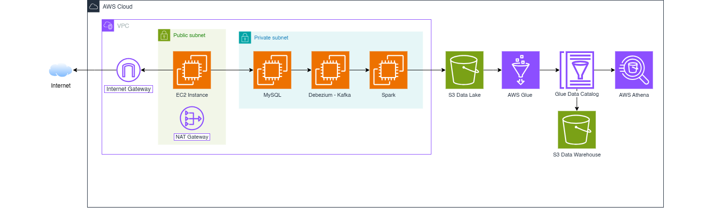

# Realtime Data Streaming | Data Engineering Project

## Introduction 
This project is my self-learning projects that utilizes technological stack to establish an end-to-end data processing pipeline. This 	 Stock API from [Alphavantage]("https://www.alphavantage.co/"). The 
The entire pipeline is encapsulated within **Docker** containers, affording a streamlined and portable deployment mechanism. 

The workflow includes: 
- Producing persistent data in **MySQL** using an API built with **Flask**.
- Identify and track changes to data in a database using **Debezium**.
- Read the streaming data from **Kafka** topic using **PySpark** (Spark Streaming).
- Write the streaming data to **AWS S3**.
- Schedule **AWS Glue** job to extract data and loading into **Glue Data Catalog**. (AWS deployment)
- Querying the data with **AWS Athena**. (AWS deployment)

This project can be deployed in two environments: local and AWS.

## System Architecture
- [**Local**](./local/README.md)
- [**AWS**](./terraform/README.md)

---

&copy; 2025 XuanThanh

