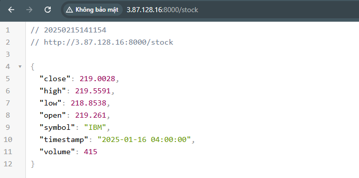
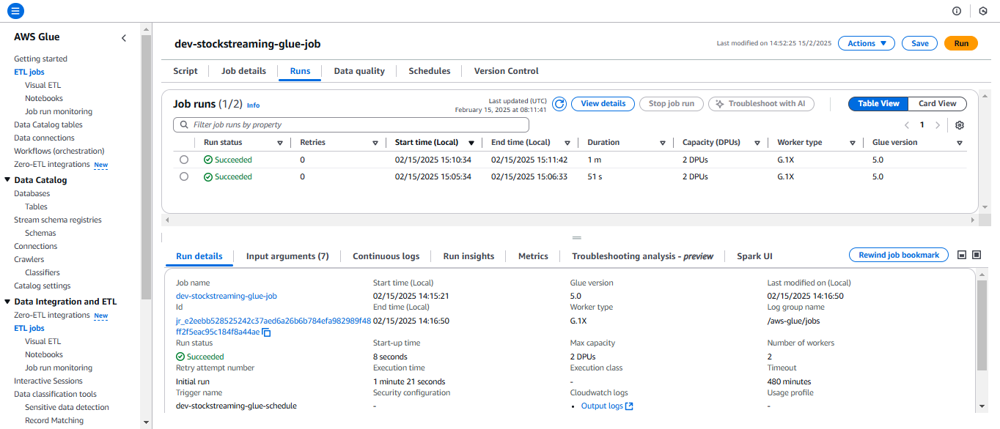

# Realtime Data Streaming | Data Engineering Project (Local Deployment)

## Introduction 
This section will guide you through the deployment of the project on your local machine. The project uses **Docker** to containerize the application and **Docker Compose** to manage the services.

## System Architecture


## Prerequisites
- Docker
- AWS Access Key, AWS Secret key

## Getting Started
1.  **Clone the repository**:
    ```bash
    git clone https://github.com/stillxthahn/stock-streaming
	cd stock-streaming/local
    ```

2. **Setting up environment variables**:

	```bash
	123
	```


3. **Build and run docker containers**:
	```bash
   	docker-compose up
    ```

	Your containers should now be created and it takes about 4-5 minutes to complete.


## How-to Guide
1. **Accessing client container**:
 - You can access the client container ```localhost:8000```. The client container is a Flask application that interacts with the API to fetch and insert data into the database.


 - You first fetch the data from the API using ```/fetch``` endpoint and then insert them row by row into the database using ```/stock``` endpoint. 


  
2. **Deploying the MySQL connector**:

- Deploy the MySQL connector to stream data from the MySQL database to Kafka by running the following command.

```bash
bash connector/deploy_connector.sh
```

- The script simply sends a POST request to the Kafka Connect REST API to deploy the MySQL connector. The connector configuration is stored in the ```/connector/connector-config.json``` file. 
```json
{
    "name": "stock-connector",
    "config": {
        "connector.class": "io.debezium.connector.mysql.MySqlConnector",
        "tasks.max": "1",
        "database.hostname": "mysql",
        "database.port": "3306",
        "database.user": "root",
		"database.password": "root",
        "database.server.id": "184054",
        "topic.prefix": "dbserver1",
        "database.include.list": "STOCK_STREAMING",
        "schema.history.internal.kafka.bootstrap.servers": "kafka:9092",
        "schema.history.internal.kafka.topic": "schema-changes.STOCK_STREAMING"
    }
}
```
- The connector will stream data from the database ```STOCK_STREAMING``` to the Kafka topic ```dbserver1.STOCK_STREAMING```.
- The connector will also store the schema changes in the Kafka topic ```schema-changes.STOCK_STREAMING```.
- You can monitor the connector by accessing  ```localhost:8003/connectors```.
- 


3. **Submit**:
 - Monitor the Glue job ```dev-stockstreaming-glue-job``` by accessing the AWS Glue console. The job will be triggered **every 5 minutes** to extract data from the S3 bucket datalake and load it into the Glue Data Catalog.
  


4. **Querying the data with Athena**:
 - Query the data using Athena by accessing the AWS Athena console. You can run the following query to get the data from the ```123```database.

```sql
```


5. **Destroying infrastructure**:
 - Destroy the infrastructure using the following command:

```bash
	terraform destroy
```

---

<p>&copy; 2025 XuanThanh</p>


	