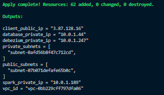

# Realtime Data Streaming | Data Engineering Project (Local Deployment)

## Introduction 
This section will guide you through the deployment of the project on your local machine. The project uses **Docker** to containerize the application and **Docker Compose** to manage the services.

## System Architecture


## Prerequisites
- Docker
- AWS Access Key, AWS Secret key

## Getting Started
1.  **Clone the repository**:
    ```bash
    git clone https://github.com/stillxthahn/stock-streaming
	cd stock-streaming/local
    ```

2. **Setting up environment variables**:

	```bash
	export TF_VAR_access_key="your-access-key"
	export TF_VAR_secret_key="your_secret_key"
	```

	> **Note:** On Windows, you can set these variables in environment variables under System Properties.

3. **Creating infrastructure**:
	```bash
   	terraform init
	terraform plan
	terraform apply
    ```

	Your infrastructure should now be created and it takes about 4-5 minutes to complete.

Inital output will be:



## How-to Guide
1. **Accessing client instance**:
 - You can access the client instance using the public IP address provided in the output with port 8080.


 - You first fetch the data from the API using ```/fetch``` endpoint and then insert them row by row into the database using ```/stock``` endpoint. 


  
2. **Monitoring Data lake**:
 - Monitor the data lake by accessing the S3 bucket ```dev-stockstreaming-ibm```. It will store all the data in the form of csv files.


3. **Monitoring Glue Job**:
 - Monitor the Glue job ```dev-stockstreaming-glue-job``` by accessing the AWS Glue console. The job will be triggered **every 5 minutes** to extract data from the S3 bucket datalake and load it into the Glue Data Catalog.
  


4. **Querying the data with Athena**:
 - Query the data using Athena by accessing the AWS Athena console. You can run the following query to get the data from the ```123```database.

```sql
```


5. **Destroying infrastructure**:
 - Destroy the infrastructure using the following command:

```bash
	terraform destroy
```

---

<p>&copy; 2025 XuanThanh</p>


	