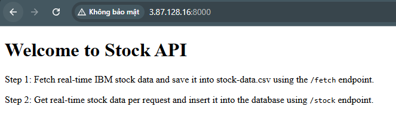

# Realtime Data Streaming | Data Engineering Project (Local Deployment)

## Introduction 
This section will guide you through the deployment of the project on your local machine. The project uses **Docker** to containerize the application and **Docker Compose** to manage the services.

## System Architecture


## Prerequisites
- Docker
- AWS Access Key, AWS Secret key

## Getting Started
1.  **Clone the repository**:
    ```bash
    git clone https://github.com/stillxthahn/stock-streaming
	chmod 400 ./stock-streaming/docker/mysql/config/mysql.cnf
	cd stock-streaming/local
    ```

2. **Build and run docker containers**:
	```bash
   	docker-compose -f docker-compose.datalake.yml -f docker-compose.yml up -d
    ```

	Your containers should now be created and it takes about 5-7 minutes to complete.

3. **Accessing the services**:
    - Client: ```localhost:8000```
    - MySQL: on port ```3306``` with username ```root``` and password ```root```
    - Kafka: on port ```9092```
    - Kafka connect: ```localhost:8083```
    - Spark worker: ```localhost:9091```
    - Minio: ```localhost:9001```
    - Prometheus: ```localhost:9090```
    - Grafana: ```localhost:3000``` with username ```admin``` and password ```admin```

## How-to Guide
1. **Accessing client container**:
 - You can access the client container ```localhost:8000```. The client container is a Flask application that interacts with the API to fetch and insert data into the database.



 - You first fetch the data from the API using ```/fetch``` endpoint and then insert them row by row into the database using ```/stock``` endpoint. 


  
2. **Deploying the MySQL connector**:

- Deploy the MySQL connector to stream data from the MySQL database to Kafka by running the following command.

```bash
    bash connector/deploy_connector.sh
```

- The script simply sends a POST request to the Kafka Connect REST API to deploy the MySQL connector and create a topic. The connector configuration is stored in the ```/connector/connector-config.json``` file. 
```json
{
    "name": "stock-connector",
    "config": {
        "connector.class": "io.debezium.connector.mysql.MySqlConnector",
        "tasks.max": "1",
        "database.hostname": "mysql",
        "database.port": "3306",
        "database.user": "root",
		"database.password": "root",
        "database.server.id": "184054",
        "topic.prefix": "dbserver1",
        "database.include.list": "STOCK_STREAMING",
        "schema.history.internal.kafka.bootstrap.servers": "kafka:9092",
        "schema.history.internal.kafka.topic": "schema-changes.STOCK_STREAMING"
    }
}
```
- The connector will stream data from the database ```STOCK_STREAMING``` to the Kafka topic ```dbserver1.STOCK_STREAMING```.
- The connector will also store the schema changes in the Kafka topic ```schema-changes.STOCK_STREAMING```.
- You can monitor the connector by accessing  ```localhost:8003/connectors```.


**3. Submit spark streaming job**:
 - Submit the Spark streaming job to consume data from the Kafka topic and write it to the S3 bucket by running the following command.

```bash
    docker exec worker /opt/bitnami/spark/bin/spark-submit --master spark://master:7077  --deploy-mode client --packages org.apache.spark:spark-sql-kafka-0-10_2.12:3.5.0 /opt/spark-scripts/main.py
```
 - Monitor the Spark job by accessing the Spark UI at ```localhost:9091```.


4. **Accessing the Minio bucket**:
 - You can access the S3 bucket by accessing the MinIO web interface at ```localhost:9001```. The default credentials are ```minio-root-user``` and ```minio-root-password```.
 - Each time you access ```localhost:8000/stock```, the data will be written to the S3 bucket.


5. **Accessing Grafana**:
 - You can access the Grafana dashboard at ```localhost:3000```. The default credentials are ```admin``` and ```admin```.
 - The dashboard is pre-configured to display the metrics from Prometheus.


6. **Stopping the services**:
 - You can stop the services by running the following command.

```bash
    docker-compose -f docker-compose.datalake.yml -f docker-compose.yml down -v
```
---

<p>&copy; 2025 XuanThanh</p>


	