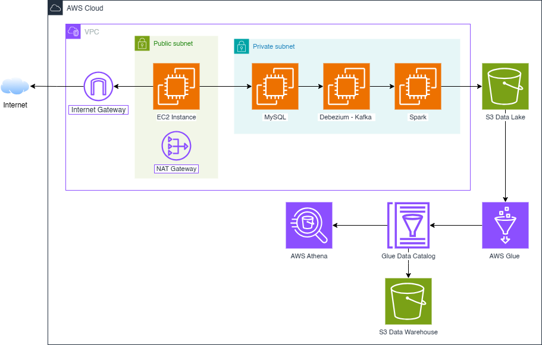

# Realtime Data Streaming | Data Engineering Project (AWS Deployment)

## Introduction 
This deployment uses **Terraform** to provision and manage the necessary AWS infrastructure.

## System Architecture


## Prerequisites
- Terraform 1.10.5
- AWS Access Key, AWS Secret key

## Getting Started
1.  **Clone the repository**:
    ```bash
    git clone https://github.com/stillxthahn/stock-streaming
	cd stock-streaming/terraform
    ```

2. **Export your AWS Access and Secret keys**:
	```bash
   	export TF_VAR_access_key="your-access-key"
	export TF_VAR_secret_key="your_secret_key"
    ```

3. **Creating infrastructure**:
	```bash
   	terraform init
	terraform plan
	terraform apply
    ```

## How-to Guide

1.  **Create Connector Postgres to Debezium**
2.      ```bash
    cd debezium/
    bash run.sh register_connector configs/orders-cdc.json
    ```